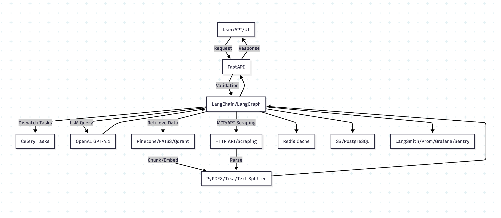

# DeepScout

# Deep Research Agent: Tech Stack Analysis

## Architecture Overview

*Architecture diagram showing the complete flow of the Deep Research Agent system, including orchestration, LLM integration, retrieval mechanisms, and data processing components.*

## 1. Orchestration & Agent Flow

- **Workflow/Agent Libraries:**
  - **LangChain**: For multi-agent orchestration, prompt templates, memory, and tool integration.
  - **LangGraph**: To define branching, retry, and concurrent flows between agents.
  - **Celery**: For distributed task queueing and background execution (e.g., parallel subtasks).
- **Observability:**
  - **LangSmith**: For debugging, tracing, and monitoring agent interactions and token usage.

## 2. Large Language Model (LLM) & Embeddings

- **LLM/API:**
  - **OpenAI GPT-4.1** (via `openai` Python SDK) for reasoning, synthesis, and summarization.
- **Embeddings for RAG:**
  - `text-embedding-ada-002` (OpenAI) via LangChain or directly through Pinecone embedding API.

## 3. Retrieval (RAG & Static Documents)

- **Vectorstore:**
  - **Pinecone**: For vector search and semantic retrieval.
  - **Optional**: **FAISS** or **Qdrant** as alternative open-source vectorstores.
- **Chunking/Parsing:**
  - **PyPDF2** or **PDFMiner** (for PDF text extraction).
  - **Tika** (for more robust file parsing across formats).
- **Text Splitters:**
  - LangChain’s built-in **RecursiveCharacterTextSplitter** for document chunking.

## 4. Retrieval (MCP – Dynamic & Structured Data)

- **MCP Client Integration:**
  - **Custom HTTP Client** (requests or httpx): To call MCP APIs.
  - **Web Scraping**: **Playwright** (with a Python wrapper), or **BeautifulSoup** for traditional scraping.
- **PDF/tools-as-API:**
  - Python **gRPC** or **FastAPI** as a wrapper to serve tool functions as MCP endpoints (PDF parsing, database APIs).
- **Database:**
  - **psycopg2** or **SQLAlchemy** for direct PostgreSQL queries.

## 5. Memory, Citation, and Context Management

- **Cache/Queue:**
  - **Redis**: For intermediate storage, deduplication, and caching agent responses.
- **Persistent Storage:**
  - **AWS S3**: For long-term document and report storage.
  - **PostgreSQL**: For metadata and audit trails.

## 6. API & External Interfaces

- **Web API:**
  - **FastAPI**: For building robust, async REST or OpenAPI endpoints.
  - **Uvicorn**: As the ASGI server for local or production deployment.
- **Testing:**
  - **pytest** for unit/integration tests.
  - **httpx** for API endpoint testing.

## 7. Development, Monitoring & CI/CD

- **Dev Tools:**
  - **black**/**ruff**/**mypy**: Formatting, linting, static type checking.
  - **pre-commit** for git hooks.
- **Monitoring:**
  - **Prometheus** & **Grafana**: For infra- and model-level monitoring if self-hosted.
  - **Sentry**: For error tracking.
- **CI/CD:**
  - **GitHub Actions** or **GitLab CI** for automated build, lint, and deploy pipelines.
- **Documentation:**
  - **MkDocs** or **Sphinx**: For technical docs if needed.

## Architecture Recap Table

| Component            | Purpose/Role                  | Python Library/Frameworks                  |
|----------------------|------------------------------|--------------------------------------------|
| Orchestration        | Agent workflow, pipelines     | LangChain, LangGraph, Celery               |
| LLM & Embeddings     | Reasoning/RAG                | openai, LangChain, Pinecone                |
| Static Retrieval     | Vector search/chunking        | Pinecone, PyPDF2, PDFMiner, LangChain      |
| MCP Integration      | Dynamic data/tools            | requests/httpx, Playwright, gRPC/FastAPI   |
| Caching/Queue        | Memory/parallelism            | Redis, Celery                              |
| Storage/Metadata     | Docs/metadata                 | AWS S3, PostgreSQL, SQLAlchemy             |
| API Layer            | REST interface                | FastAPI, Uvicorn                           |
| Observability/Debug  | Monitoring/tracing            | LangSmith, Sentry, Prometheus (optional)   |
| Dev/Test             | DevX & QA                     | pytest, black, pre-commit, httpx, mypy     |